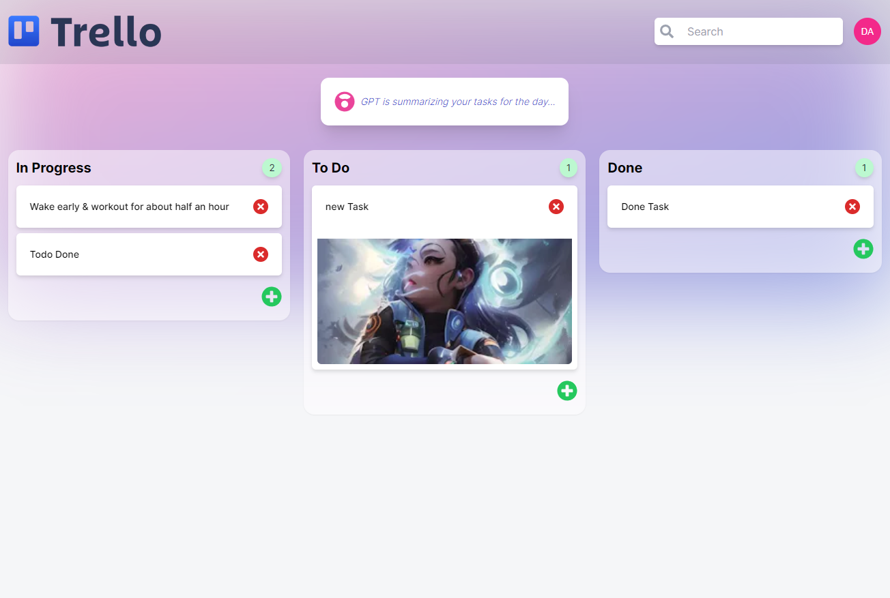

# Trello Clone 2.0 in Next.js

## Tech Stack

- Zustand :- for state management
- Typescript :- for safe type checking
- React Icons :- for icons
- React Avatar :- for avatar
- Appwrite :- for database
- HeadlessUI :- for UI Component
- Hello Pangea DND :- for drag & drop functionality

## How to run Locally

1. First fork or clone the repo then inside root folder run `npm run dev`.
2. Then make a .env.local file in root dir & initialize variables. For ex :- NEXT_PUBLIC_DATABASE_ID (databaseId from appwrite), NEXT_PUBLIC_COLLECTION_ID(from appwrite collection), NEXT_PUBLIC_BUCKET_ID(from appwrite storage).
3. You are done & ready to run.

**You can view the live site _[Trello Clone](https://trello-clone-appwrite-two.vercel.app/)_**

### Home Page UI

